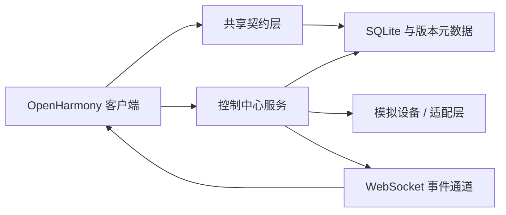
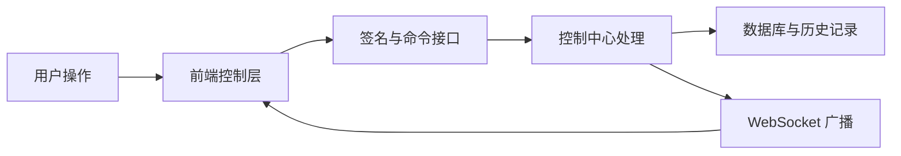
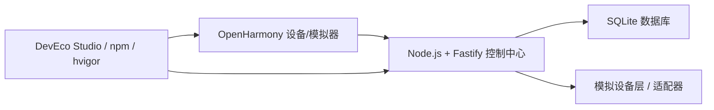

# 智能家居控制系统产品总体设计文档（扩展版）

## 1 引言

### 1.1 编写目的

本文档用于对 `OmniHome` 智能家居控制系统的总体设计方案进行完整、系统、可答辩化的说明。与简版总体设计不同，本扩展版文档不仅描述系统“由哪些部分组成”，还重点回答以下几个问题：

1. 为什么系统要采用当前的分层架构，而不是直接以前端页面对接后端接口的简单方式实现。
2. 智能家居场景下最核心的数据链路、控制链路、同步链路和实时链路是如何组织的。
3. 当前系统如何在“可演示原型”的前提下，尽可能向“可持续扩展的工程化系统”靠拢。
4. 后续如果从模拟设备演进到真实物联网设备接入，哪些部分可以平滑替换，哪些部分需要扩展。

本文档既可作为课程设计或毕业设计中的《产品总体设计文档》，也可作为项目组内部统一理解系统边界、数据模型、接口约束和部署结构的技术参考材料。

### 1.2 项目背景

随着家庭数字化与物联网设备普及，门锁、灯具、空调、摄像头、空气传感器、窗帘、插座、场景面板等智能设备正在逐步进入普通家庭。设备种类增多虽然提升了家庭自动化和便利性，但也带来了新的管理问题：

首先，设备入口分散。不同厂商、不同协议和不同终端往往对应不同 App 或不同控制入口，用户在实际使用过程中需要频繁切换应用，难以形成统一的家庭控制体验。

其次，设备状态割裂。灯光页面能看到灯的状态，门锁页面能看到门锁状态，但家庭整体层面缺少统一的状态总览，用户很难迅速判断当前家中是否存在异常，例如某个房间灯未关闭、某个设备掉线、某个摄像头未在录制。

再次，控制反馈滞后。很多简单演示型系统只完成了“按钮点击后调用接口”的逻辑，却没有完整处理命令执行结果、状态回写、失败反馈、历史留痕和实时同步，导致系统看起来能用，但并不真正可靠。

最后，扩展成本高。如果系统前期没有统一契约、没有明确的分层、没有考虑缓存与同步，一旦后续新增设备类型、自动化规则、权限机制或多终端访问能力，就容易陷入“牵一发动全身”的重构困境。

基于上述问题，本项目设计并实现了 `OmniHome` 智能家居控制系统。系统以 OpenHarmony 客户端作为统一交互入口，以 Fastify 控制中心服务作为业务中枢，以共享契约层作为前后端协同边界，以 SQLite 和版本化同步机制作为本地状态与数据一致性的基础，形成一个适合课程展示、功能演示、架构答辩和后续扩展的智能家居系统原型。

### 1.3 项目目标

本系统的建设目标可概括为以下五个方面：

#### 1.3.1 实现统一控制入口

系统需要为用户提供单一应用入口，使其可以在同一控制界面内完成家庭设备总览、门禁管理、摄像监控、环境控制、家庭广播、场景执行与自动化管理，而不必依赖多个分散入口。

#### 1.3.2 实现完整控制闭环

系统不仅要支持发起控制命令，还要支持命令签名、命令验证、命令执行、设备状态更新、历史记录写入、实时事件广播以及前端状态回显，形成闭环式业务处理链路。

#### 1.3.3 实现状态同步与本地缓存

系统需要支持前端本地缓存、增量同步和实时推送机制，避免单纯依赖全量刷新和频繁轮询。这样既可以提高用户体验，也可以为将来离线容错与弱网容错提供基础。

#### 1.3.4 实现可扩展架构

系统应在初期就对设备模型、命令结构、场景定义、接口组织和数据库结构做抽象，使后续接入更多设备、更多页面和更多家庭规则时能够以较低成本扩展。

#### 1.3.5 实现面向答辩的可演示性

由于本项目带有课程设计和原型演示属性，因此系统还需要具备明确的演示边界、可解释的架构逻辑、可展示的异常场景以及能被文档清晰说明的数据流与控制流。

### 1.4 目标用户

系统的直接使用者主要包括以下几类：

#### 1.4.1 家庭主用户

家庭主用户通常负责家庭设备的整体管理，需要查看全屋设备在线状态、调整核心设备参数、维护家庭场景和管理自动化规则。

#### 1.4.2 家庭成员

普通家庭成员更关注简洁、直观和高频操作，例如开关灯、调整空调温度、查看门锁状态、接收家庭广播等，因此系统需要提供清晰的模块导航与较低的操作门槛。

#### 1.4.3 项目评审者与课程教师

对于课程环境而言，教师和评审者不是实际业务用户，但他们是系统设计质量的判断者。因此文档和系统本身都需要具备“结构清晰、边界明确、逻辑可验证”的特征。

### 1.5 设计原则

为了使系统既满足原型展示需求，又具备工程化扩展空间，本文档采用以下设计原则指导总体设计：

#### 1.5.1 分层解耦原则

前端展示、前端控制逻辑、接口访问逻辑、后端路由、领域服务、数据库访问和设备适配应尽量分层组织，减少彼此之间的直接耦合。

#### 1.5.2 统一契约原则

设备状态、设备命令、场景定义和安全信封等核心数据结构在系统中必须统一定义，避免前后端各自理解不同造成联调错误。

#### 1.5.3 增量同步原则

系统不依赖粗放式全量刷新，而是通过版本号和增量数据包完成状态同步，提高效率并降低前端更新复杂度。

#### 1.5.4 安全前置原则

尽管当前系统是原型系统，但对命令链路仍然采用签名和重放保护机制，将安全约束提前放入架构层，而不是后期补丁式加入。

#### 1.5.5 可替换性原则

模拟设备层必须被设计为可替换结构，使系统在未来接入真实网关、真实驱动或真实物联网平台时，不必重写上层业务逻辑。

### 1.6 文档范围

本文档重点说明系统总体设计，不展开如下内容：

1. 不对每个 ArkTS 页面逐行代码实现进行详解。
2. 不对 OpenHarmony SDK 安装、DevEco Studio 环境修复等工具级问题做深入说明。
3. 不将当前模拟设备系统描述为已接入真实商业物联网平台。
4. 不将 HTTPS 预留能力夸大为完整的商用级零信任安全体系。

换言之，本文档坚持“以当前仓库和当前架构为依据”的原则，说明已经具备的设计和已经预留的扩展方向。

## 2 系统总体设计

### 2.1 系统定位

`OmniHome` 智能家居控制系统定位为一个“集中控制型智能家居中控原型系统”。这里的“集中控制型”包含两层含义：

第一，控制入口集中。原本散落在多个页面、多个设备逻辑甚至多个应用中的控制行为，被统一抽象到一个中控系统中完成组织和呈现。

第二，状态理解集中。系统并不只是机械地透传设备状态，而是通过首页摘要、模块总览、历史记录、事件推送等方式，把多个设备状态组织成对用户有意义的家庭状态视图。

因此，本系统不是一个简单的“设备面板集合”，而是一个具备家庭状态中枢特征的控制系统。它强调：

1. 从页面到服务端的数据闭环。
2. 从设备状态到业务摘要的聚合能力。
3. 从单次控制到历史留痕的可追踪能力。
4. 从当前状态到实时变化的可同步能力。

### 2.2 建设思路

系统总体设计的建设思路不是“先做界面，再补后端”，而是采用“产品场景驱动 + 架构主线先行”的方式展开。也就是说：

1. 先明确系统支持哪些核心家庭场景。
2. 再围绕这些场景抽象出统一的设备模型和命令模型。
3. 在此基础上设计控制中心服务、同步机制和实时推送机制。
4. 最后由前端按功能域消费这些能力。

这种顺序的优势在于，页面不会成为系统唯一中心，后端也不会只是被动的“接口仓库”，而是能够从一开始就形成围绕设备、命令、状态和同步构建的完整系统骨架。

### 2.3 系统总体结构

从总体上看，系统由以下四个核心层次构成：

#### 2.3.1 客户端应用层

客户端应用层运行在 OpenHarmony 环境中，主要负责界面呈现、用户交互、页面导航、局部状态维护和控制指令触发。该层面向用户，是系统的直接使用界面。

#### 2.3.2 控制中心服务层

控制中心服务层由 Fastify 提供支撑，是系统的业务核心。它负责管理设备注册表、场景注册表、房间注册表、命令历史、数据库版本同步、命令验签以及 WebSocket 事件广播。

#### 2.3.3 共享契约层

共享契约层位于 `packages/device-contract` 中，用于统一定义前后端共同依赖的设备模型、命令结构和安全信封结构。该层是系统中“语义一致性”的关键保障。

#### 2.3.4 数据与设备层

数据与设备层包含 SQLite 数据库、设备状态快照、版本元数据以及模拟设备和适配器实现。它为业务层提供状态来源、持久化支撑和设备执行基础。

### 2.4 总体设计原则详述

#### 2.4.1 前端轻业务、后端重编排

系统并没有把复杂逻辑堆到前端，而是让前端聚焦于组织用户意图、发起请求和展示结果；真正的状态更新、命令执行、事务控制和事件广播由后端完成。这样设计的好处是：

1. 页面逻辑更容易维护。
2. 命令执行规则统一，不容易出现不同页面行为不一致的问题。
3. 未来新增客户端时，可以复用同一套控制中心能力。

#### 2.4.2 结构化状态而非散乱变量

系统状态并不是各页面自己维护一批零散变量，而是围绕“设备、房间、场景、自动化、历史记录”这些实体建立结构化模型。结构化状态能够天然支持同步、持久化和扩展。

#### 2.4.3 版本驱动同步而非全量拉取

若每次进入页面都全量拉取所有家庭数据，一方面开销较大，另一方面无法优雅处理多页面刷新和后台状态变化。当前系统通过 `global_version` 和各表 `version` 字段实现版本驱动同步，使客户端只获取变化部分，从而提高效率。

#### 2.4.4 事件推送补充轮询

系统并未完全依赖前端重复发起请求来获取状态变化，而是通过 WebSocket 将关键状态变化主动广播给客户端。这一设计尤其适用于门锁状态变化、场景执行结果回写、设备上下线等需要快速反馈的场景。

### 2.5 系统边界

系统边界是总体设计文档中必须明确说明的部分，因为很多原型项目在答辩时容易把“可扩展方向”说成“当前已实现能力”。本系统边界如下：

#### 2.5.1 已纳入系统边界的内容

1. OpenHarmony 客户端页面与交互流程。
2. Fastify 控制中心服务。
3. 设备、场景、自动化、房间、历史等核心业务结构。
4. HMAC 命令签名与重放保护。
5. SQLite 持久化、版本同步与 WebSocket 推送。
6. 模拟设备层与演示异常注入接口。

#### 2.5.2 尚未纳入系统边界的内容

1. 商业级用户身份认证与权限中心。
2. 真实第三方物联网平台对接。
3. 云端多家庭长期数据托管。
4. 复杂规则引擎、AI 场景推荐和跨家庭共享能力。

明确边界有助于保证文档真实性，也能让后续扩展规划更加清楚。

### 2.6 总体业务流程

从用户视角看，系统总体业务流程如下：

1. 用户打开客户端并进入首页。
2. 首页读取摘要数据、设备列表和模块状态。
3. 用户进入门禁、气候、摄像头、自动化等具体模块。
4. 当用户发起设备控制或场景执行时，前端先组织命令，再请求签名，再正式提交执行。
5. 后端在执行后更新数据库状态，并通过实时通道通知前端。
6. 前端将事件落地为新的界面状态，同时保留历史记录供用户回看。

这一流程体现出系统是“以状态为中心”的，而非“以页面按钮为中心”的。

## 3 系统架构设计

### 3.1 架构概述

系统总体采用“客户端应用层 + 控制中心服务层 + 共享契约层 + 数据与设备层”的四层架构。该架构的核心思想是：通过明确边界，让每一层专注于自己的职责，并通过统一契约和标准接口完成协作。

从逻辑关系上看，系统的主链路可抽象为：

`ArkTS View -> Controller/ViewModel -> Repository -> DeviceApi -> Fastify Routes -> Registry / Database / Simulator -> WebSocket / Sync -> 前端状态回写`

这条链路完整描述了从页面操作到后端业务执行，再到前端状态刷新的一整套机制。

### 3.2 前端架构设计

#### 3.2.1 前端架构目标

前端架构的主要目标不是“把页面做出来”，而是满足以下要求：

1. 让页面层保持较高可读性。
2. 让业务逻辑尽量从视图中抽离。
3. 让数据访问逻辑具备统一入口。
4. 让本地缓存、同步数据和实时事件能汇聚到一致的数据处理流程中。

#### 3.2.2 页面层

页面层直接对应用户可见界面，是用户操作与视觉反馈的承载面。项目中主要包括：

1. 首页总览页面。
2. 门禁控制页面。
3. 摄像头监控页面。
4. 气候控制页面。
5. 家庭成员与广播页面。
6. 自动化与场景页面。
7. 通知与历史页面。

页面层的职责主要包括展示数据、响应用户点击、触发导航和呈现错误反馈。页面层不应直接拼装复杂请求，也不应直接处理数据库或同步策略。

#### 3.2.3 控制层与视图模型层

控制层和视图模型层的意义在于把“页面要做什么”与“系统应该怎么做”区分开来。比如：

1. 用户点击开灯，本质上不是“改一个 UI 布尔值”，而是“构造一次设备开关命令，并走安全链路提交到服务端”。
2. 用户进入首页，本质上不是“读取一个接口”，而是“加载摘要、设备列表和状态统计，然后组织成首页所需的视图模型”。

因此，控制层与视图模型层承担页面与仓储之间的桥梁作用，负责：

1. 解释用户意图。
2. 组织页面依赖的数据结构。
3. 调用仓储层统一访问远端与本地数据。
4. 对错误、空态、加载态进行统一处理。

#### 3.2.4 仓储层

仓储层是前端架构中非常关键的一层。它的价值在于：

1. 将本地缓存读取与远程接口访问统一封装。
2. 为不同页面提供稳定的数据访问入口。
3. 接收同步结果和实时事件，完成状态整合。

如果没有仓储层，页面可能会直接调用多个 API，导致数据来源散乱、更新时机不一致、重用困难。仓储层的存在可以让“页面如何读数据”和“系统数据从哪里来”解耦。

#### 3.2.5 前端状态回写机制

前端并不是在命令发出后立即假设操作成功，而是在后端确认执行并更新状态后，通过同步或事件回写刷新 UI。这种模式比“前端乐观直接改界面”更适合智能家居场景，因为物理世界控制存在失败、拒绝和设备离线等风险。

### 3.3 后端架构设计

#### 3.3.1 后端职责定位

控制中心服务不是“简单 API 转发层”，而是系统的控制中枢。其职责包括：

1. 提供 REST API 和 WebSocket 入口。
2. 持有设备注册表和业务注册表。
3. 对命令执行进行校验与编排。
4. 维护数据库状态与版本信息。
5. 维护场景和自动化业务逻辑。
6. 维护命令历史与异常演示能力。

#### 3.3.2 路由模块化设计

系统在 `buildApp()` 中注册多个路由模块，包括：

1. `devices` 路由：设备列表、设备详情、首页摘要、设备房间归属。
2. `access` 路由：门禁状态、数字钥匙和访客授权。
3. `camera` 路由：摄像头概览和录制切换。
4. `climate` 路由：气候概览、目标温度和运行模式。
5. `family` 路由：家庭成员动态和广播消息。
6. `scenes` 路由：场景查询、维护、启停与执行。
7. `automations` 路由：自动化规则查询和维护。
8. `commands` 路由：签名、控制命令和历史记录。
9. `sync` 路由：按版本返回增量数据。
10. `websocket` 路由：实时事件通道。
11. `demo` 路由：环境修改、异常注入和安全拒绝演示。

这种设计的优点是，每条业务线都有明确边界，开发、测试和扩展时都更加清晰。

#### 3.3.3 设备注册表

设备注册表负责维护当前系统已知设备及其状态，是设备层和接口层之间的重要桥梁。它的存在使系统不必把设备状态完全散落在接口处理函数中，而是以注册表形式集中组织。

注册表机制的主要价值包括：

1. 提供快速设备查找能力。
2. 提供统一设备状态更新入口。
3. 为摘要统计、设备列表和控制执行提供一致的状态源。

#### 3.3.4 场景注册表与自动化能力

场景注册表维护可执行场景及其启停状态。场景与自动化虽然都属于“多设备联动能力”，但语义不同：

1. 场景偏“显式触发”，例如用户点击“离家模式”。
2. 自动化偏“条件触发”，例如晚上十点自动锁门。

在架构上将两者分开，有利于后续扩展更复杂的规则引擎。

#### 3.3.5 命令历史

命令历史用于记录用户发起的设备控制和系统返回的执行结果，是通知页和系统可追踪性的基础。历史记录不仅对用户可见，也对系统调试和演示异常状态具有重要意义。

#### 3.3.6 数据库服务

数据库服务不是简单的 CRUD 包装，而是承担如下作用：

1. 管理版本号递增。
2. 组织增量同步数据。
3. 确保事务更新原子性。
4. 为前端同步链路提供结构化响应。

### 3.4 共享契约设计

#### 3.4.1 共享契约的必要性

在智能家居系统中，如果前端自己定义一套设备模型，后端自己维护另一套设备模型，很容易导致字段含义不一致、命令名称不统一、时间戳格式不一致等问题。共享契约层就是为解决这种问题而存在的。

#### 3.4.2 共享契约的主要内容

共享契约层主要包括以下类型：

1. 设备描述类型。
2. 设备状态类型。
3. 增强设备快照类型。
4. 设备命令类型。
5. 场景描述类型。
6. 场景执行结果类型。
7. 命令历史条目类型。
8. 安全信封类型。

#### 3.4.3 共享契约带来的收益

共享契约层为系统带来的收益主要体现在：

1. 前后端开发语言虽然不同，但能围绕统一数据结构协作。
2. 新增设备或新命令时，只需先扩展契约层，再扩展两端实现，过程更规范。
3. 测试时可以针对契约做结构性校验，减少隐式错误。

### 3.5 数据与设备层设计

#### 3.5.1 SQLite 的定位

SQLite 在当前系统中的定位不是“大型生产数据库替代品”，而是轻量级、可嵌入、适合演示和本地版本化管理的数据载体。它足够支撑当前原型的状态管理与同步需求。

#### 3.5.2 模拟设备层的定位

模拟设备层是系统能形成完整闭环的重要前提。没有模拟设备，系统只能“看起来能发请求”，却不能真实反映控制结果。模拟设备层让后端在收到命令后可以更新门锁、灯光和空调状态，从而保证控制链路完整。

#### 3.5.3 可替换性设计

模拟设备层通过设备模拟器或适配器方式接入，这意味着未来若要接入真实设备，只需替换底层执行逻辑，而不必重写上层接口、同步、历史记录与事件推送机制。

## 4 功能模块设计

### 4.1 功能模块划分依据

系统模块划分不是按代码目录机械划分，而是按用户认知和业务域划分。这样划分有两个优势：

1. 用户理解更自然。
2. 文档表达更贴近“产品总体设计”的目标。

系统当前功能模块主要分为：首页总览、设备控制、门禁管理、摄像头监控、气候控制、场景管理、自动化管理、家庭管理、通知与历史、系统支撑。

### 4.2 首页总览模块

首页总览模块是系统的入口页，也是最能体现“集中控制平台”价值的页面。其设计重点不是展示所有细节，而是用有限信息帮助用户快速判断家庭整体状态。

首页总览模块主要包括：

1. 在线设备数量。
2. 灯光数量和运行概况。
3. 温湿度与空气质量。
4. 重点告警或异常状态。
5. 常用业务模块的快捷入口。

该模块的设计原则是“信息摘要优先”。用户进入首页后，应先判断家庭整体是否正常，再决定是否进入具体模块。

### 4.3 设备控制模块

设备控制模块是系统中最基础、也是最关键的功能模块之一。它面向灯光、门锁、空调等核心家庭设备提供统一控制入口。

#### 4.3.1 灯光控制

灯光控制支持：

1. 开关控制。
2. 亮度调节。
3. 色温切换。
4. 房间归属展示。

灯光是最常见的家庭设备之一，也是最适合演示“状态回写”和“场景联动”的对象。

#### 4.3.2 门锁控制

门锁控制模块负责展示主锁状态和相关入口点信息，并支持门锁切换与访客授权。由于门锁属于高敏感设备，其控制链路必须纳入完整的签名和授权逻辑。

#### 4.3.3 空调控制

空调控制模块不仅包含开关，还包含目标温度与模式管理。相比灯光和门锁，空调状态更具连续性和参数性，因此更适合体现系统对复杂设备状态的建模能力。

### 4.4 门禁管理模块

门禁管理模块比基础门锁控制更进一步，它从“单一门锁设备”上升到“家庭出入管理”层面，主要包含：

1. 主门锁状态。
2. 访客临时钥匙创建。
3. 其他入口点信息展示。
4. 访问行为可视化。

这说明系统设计并不是停留在单一设备控制，而是尝试以更高层次组织业务。

### 4.5 摄像头监控模块

摄像头模块主要提供：

1. 摄像头概览。
2. 录制状态切换。
3. 最近动态展示。
4. 安防相关信息入口。

它在系统中的作用主要有两个：一是扩展中控平台在安防场景下的适用性；二是为系统提供与普通设备不同的“监控型设备”样例。

### 4.6 气候控制模块

气候控制模块围绕客厅气候信息和空调运行策略展开，重点包括：

1. 当前温度与湿度。
2. 目标温度。
3. 运行模式切换。
4. 周使用趋势或能耗提示。

气候模块的设计重点不是“开空调”这么简单，而是让系统具备一定的环境调节表达能力。

### 4.7 场景管理模块

场景管理模块负责将多个设备操作组织成可复用控制方案，例如：

1. 回家模式。
2. 离家模式。
3. 睡眠模式。
4. 会客模式。

场景的产品意义在于，它将多次离散操作抽象为一次高层操作，提高系统的智能化表达能力，也符合家庭场景的实际使用习惯。

### 4.8 自动化管理模块

自动化管理模块与场景管理的区别在于其“自动触发”属性。系统当前支持以规则方式描述触发条件与动作集合，为后续扩展复杂自动化提供结构基础。

自动化管理模块的核心价值在于：

1. 提高系统自治能力。
2. 降低用户重复操作次数。
3. 为后续规则引擎或 AI 规则推荐打基础。

### 4.9 家庭管理模块

家庭管理模块让系统具备“家庭协同”属性，而不仅仅是“设备控制属性”。该模块当前主要包括：

1. 家庭成员动态。
2. 近期活动时间线。
3. 全屋广播消息追加。

这使系统在产品层面更接近“家庭控制中心”，而不是单一设备面板。

### 4.10 通知与历史模块

通知与历史模块主要负责展示系统命令历史和场景执行记录。它的作用包括：

1. 为用户提供可追踪性。
2. 为开发和测试提供观察窗口。
3. 为异常演示提供直观证据。

一个没有历史回显的控制系统，往往难以解释“刚刚到底发生了什么”；历史模块恰好补上了这条证据链。

### 4.11 系统支撑模块

系统支撑模块不一定直接被用户感知，但它对系统质量至关重要，主要包括：

1. 版本同步。
2. 事件广播。
3. 本地缓存。
4. 安全信封。
5. 异常演示接口。
6. 设备状态与房间关系维护。

从总体设计视角看，支撑模块决定了系统是否真的具备“系统性”，而不是停留在多个页面的简单拼接。

## 5 数据库设计

### 5.1 设计目标

数据库设计目标主要包括：

1. 保存核心业务实体状态。
2. 支持版本化增量同步。
3. 支持命令历史追踪。
4. 支持轻量部署和本地演示。
5. 为后续替换为更大规模数据库打下结构基础。

### 5.2 数据库选型

当前系统使用 SQLite 作为数据库，原因包括：

1. 部署简单，无需单独安装服务。
2. 对课程原型和本地演示足够稳定。
3. 与 Node.js 生态适配较好。
4. 适合保存结构化状态与少量历史数据。

对于课程项目而言，这种选型兼顾了工程合理性与环境可控性。

### 5.3 核心数据表

#### 5.3.1 metadata 表

`metadata` 表主要保存全局元数据，例如：

1. `global_version`
2. `schema_version`

其意义在于承载系统级版本控制与迁移控制。虽然字段不多，但这是整个同步体系的关键基础。

#### 5.3.2 devices 表

`devices` 表是最核心的数据表之一，记录设备标识、设备名称、设备类型、所属房间、状态 JSON、更新时间、版本号与删除标记等信息。

其设计特点包括：

1. 用 `state_json` 保存结构化状态快照，兼容不同设备类型。
2. 用 `version` 支撑增量同步。
3. 用 `is_deleted` 支持软删除和同步传播。

#### 5.3.3 rooms 表

`rooms` 表用于保存房间信息。智能家居系统中的设备往往与空间密切相关，因此房间不仅是显示标签，更是组织设备、构建家庭地图和支持场景编排的重要维度。

#### 5.3.4 scenes 表

`scenes` 表保存场景的描述信息、启用状态和动作配置。场景本质上是一种高层业务对象，不直接等同于单个设备状态，因此需要独立建模。

#### 5.3.5 automations 表

`automations` 表保存自动化规则。与 `scenes` 相比，该表更强调“触发条件 + 执行动作”的结构，其存在说明系统从一开始就为规则型控制预留了独立空间。

#### 5.3.6 history 表

`history` 表保存命令历史。记录内容包括请求 ID、设备 ID、命令名称、状态、提示信息和创建时间。它是通知页面和系统追踪能力的重要基础。

### 5.4 数据关系分析

系统当前并未采用复杂外键约束体系，但从逻辑关系上看，实体间存在如下关系：

1. 一个房间可以关联多个设备。
2. 一个场景可以关联多个设备动作。
3. 一个自动化规则可以绑定多个触发条件和动作定义。
4. 一条历史记录通常对应一次命令执行。

当前系统以轻量实现为主，因此部分复杂关系通过 JSON 字段表达。这种设计兼顾了灵活性和实现成本。

### 5.5 版本同步机制中的数据库角色

数据库在系统中并不仅仅承担持久化职责，更承担同步协调职责。每次核心实体发生变化时，系统会：

1. 更新对应实体表中的 `version`。
2. 同步推进 `metadata.global_version`。
3. 在同步接口中按版本号筛选变化记录。

这样，数据库既是状态存储层，也是同步协议的实现基础。

### 5.6 模式迁移设计

系统通过 `schema_version` 控制数据库模式迁移。当前迁移逻辑虽然不复杂，但已经具备如下工程意义：

1. 允许系统演进过程中逐步调整字段结构。
2. 避免旧数据库文件因缺字段而导致运行时错误。
3. 为后续增加设备能力、自动化字段和更多元数据提供基础。

### 5.7 数据库设计优点与局限

优点：

1. 结构清晰，适合课程原型。
2. 对同步友好，版本机制明确。
3. 对设备状态差异具有一定兼容性。
4. 部署简单，便于演示。

局限：

1. 对复杂关系和高并发场景支持有限。
2. 对大规模历史数据分析能力不足。
3. 仍以本地单机持久化为主，不适合多实例分布式部署。

这些局限并不是设计错误，而是当前阶段的合理边界。

## 6 接口设计

### 6.1 接口设计目标

接口设计需要满足以下目标：

1. 能完整支撑当前页面和业务场景。
2. 保持接口语义清晰、分组合理。
3. 支持控制、查询、同步和实时通信四类需求。
4. 使前端对后端的访问尽量稳定而可扩展。

### 6.2 设备与摘要接口

设备与摘要接口主要包括：

1. `GET /api/devices`
2. `GET /api/devices/:deviceId`
3. `GET /api/summary`

这类接口主要作用于首页总览、设备列表与详情查询。它们体现了后端不仅提供“原始设备状态”，还提供了“聚合后的家庭摘要”。

### 6.3 命令控制接口

命令控制接口主要包括：

1. `POST /api/demo/sign-command`
2. `POST /api/commands`
3. `GET /api/commands/history`

这组接口是系统最核心的一组接口，因为它们承担了安全命令链路。其设计思想是：

1. 先对命令做签名。
2. 再提交完整信封。
3. 服务端验证后执行。
4. 执行结果进入历史并触发状态广播。

### 6.4 场景接口

场景接口包括：

1. `GET /api/scenes`
2. `POST /api/scenes`
3. `PATCH /api/scenes/:sceneId`
4. `PUT /api/scenes/:sceneId`
5. `DELETE /api/scenes/:sceneId`
6. `POST /api/scenes/:sceneId/run`

这一组接口反映出系统并未把场景设计成死数据展示，而是提供了完整的生命周期管理能力。

### 6.5 自动化接口

自动化接口包括：

1. `GET /api/automations`
2. `POST /api/automations`
3. `PUT /api/automations/:automationId`
4. `DELETE /api/automations/:automationId`

自动化接口的存在说明系统已经从“设备控制”进一步提升到“规则配置”的层面。

### 6.6 垂直领域接口

垂直领域接口主要包括：

1. 门禁接口：`GET /api/access`、`POST /api/access/guest-keys`
2. 摄像头接口：`GET /api/cameras`、`PATCH /api/cameras/:cameraId`
3. 家庭接口：`GET /api/family`、`POST /api/family/broadcast`
4. 气候接口：`GET /api/climate`、`PATCH /api/climate`
5. 房间接口：`GET /api/rooms`、`POST /api/rooms`、`PUT /api/rooms/:id`、`DELETE /api/rooms/:id`

这些接口的特点是面向明确业务域，因此有助于前端按模块开发。

### 6.7 同步接口

同步接口为：

`GET /api/sync?lastVersion=...`

其作用是根据客户端本地持有的版本号，返回之后发生变化的设备、房间、场景与自动化数据。它是系统状态一致性的关键补偿通道。

### 6.8 实时推送接口

实时接口为：

`GET /ws/events`

它负责建立 WebSocket 通道。服务端通过该通道广播 `DeviceStateUpdated` 等事件，使客户端无需持续轮询即可感知状态变化。

### 6.9 接口设计特点总结

从总体上看，本系统接口设计具有以下特点：

1. 查询接口与控制接口分离。
2. 领域接口与通用接口分离。
3. 同步接口与实时接口并存。
4. 命令执行接口具备安全前置机制。
5. 多数接口围绕业务实体组织，便于扩展。

## 7 运行设计

### 7.1 运行设计目标

运行设计部分重点回答一个问题：系统运行起来以后，数据到底怎样流动。

很多系统在文档中只写“系统支持设备控制”，但不写控制如何落地、失败如何处理、状态如何回写、页面如何更新。运行设计正是要补上这部分核心内容。

### 7.2 读取链路

读取链路用于页面初始加载和主动刷新。其过程如下：

1. 用户进入某个页面。
2. 页面层调用控制层或视图模型层。
3. 控制层调用仓储层。
4. 仓储层决定从本地缓存还是远端接口读取数据。
5. 后端返回结果后，前端将其映射为页面所需状态。
6. 页面完成渲染。

该链路强调的是“面向页面的状态装配”，而不是简单地将后端 JSON 原样显示。

### 7.3 控制链路

控制链路是系统最关键的运行链路之一，其过程如下：

1. 用户在页面中点击某个设备控制按钮。
2. 页面把动作交给控制层处理。
3. 控制层构造业务命令。
4. 前端调用签名接口获取安全信封。
5. 前端提交正式控制请求到 `/api/commands`。
6. 服务端验签并执行重放保护校验。
7. 服务端查找设备并调用模拟器执行。
8. 服务端更新数据库状态与版本号。
9. 服务端写入命令历史。
10. 服务端广播状态变化事件。
11. 前端收到事件后刷新界面。

这条链路的关键价值在于，它证明系统不是“按钮改变量”，而是真正经历了一次完整业务处理过程。

### 7.4 同步链路

同步链路用于保证前端本地状态与服务端状态最终一致。其过程如下：

1. 前端保存 `lastVersion`。
2. 当前端需要补偿同步时，调用 `/api/sync`。
3. 服务端根据版本号筛选变化记录。
4. 返回变化实体以及当前版本号。
5. 前端将变化数据落地到本地缓存。
6. 前端更新自身的同步水位。

同步链路的意义在于，当实时事件丢失、页面重新进入或缓存需要补齐时，系统仍能恢复到一致状态。

### 7.5 实时链路

实时链路用于提高反馈速度，其过程如下：

1. 前端在应用运行期间建立 WebSocket 连接。
2. 服务端保存该连接。
3. 当设备状态变化时，服务端广播事件。
4. 前端接收到事件后更新本地状态与界面。

与同步链路相比，实时链路强调“及时性”；与读取链路相比，实时链路强调“主动推送”。三者结合，使系统在体验上更接近真实中控平台。

### 7.6 异常链路

系统当前还支持异常演示链路，例如：

1. 设备掉线演示。
2. 安全拒绝演示。
3. 环境数据变化演示。

这些异常链路的存在，不只是为了答辩演示，更是为了说明系统已经考虑了控制失败、状态异常和安全拒绝这类真实问题。

### 7.7 运行设计的工程意义

运行设计最大的意义在于：它把静态架构图变成了动态可解释机制。答辩时如果没有运行链路说明，架构很容易被认为只是“画图”；有了完整链路说明，系统设计才能被理解为真正的“可运行方案”。

## 8 安全设计

### 8.1 安全设计目标

本系统虽然是课程原型，但在安全设计上仍然坚持“核心控制链路必须可解释、可约束”的原则。安全设计主要目标包括：

1. 防止客户端任意伪造控制命令。
2. 防止命令被重复提交造成重放攻击。
3. 为后续 HTTPS 化和真实设备接入预留扩展空间。
4. 使安全设计能够被文档和演示清楚说明。

### 8.2 命令签名机制

系统通过 `POST /api/demo/sign-command` 对设备命令进行 HMAC-SHA256 签名。签名后的安全信封由以下信息共同构成：

1. 原始命令。
2. 时间戳。
3. 随机 `nonce`。
4. 签名摘要。

客户端不能跳过这一步直接假造命令，否则在 `/api/commands` 阶段会被验签逻辑拒绝。

### 8.3 重放保护

系统通过 `ReplayGuard` 记录 `nonce` 和时间窗口，对重复请求或过期请求进行拒绝。其意义在于，即使攻击者拿到了某次有效命令，也不能无限次重复提交。

在智能家居场景中，这一机制非常关键，因为门锁和门禁类控制命令一旦被重放，将带来明显风险。

### 8.4 安全拒绝演示能力

系统支持通过 `POST /api/demo/faults/security` 强制开启“命令未授权”演示模式。在这一模式下，系统会直接返回 `COMMAND_UNAUTHORIZED`，并将结果写入命令历史。

这一设计具有双重意义：

1. 演示层面上，可以让评审者看到安全失败时系统并非无响应，而是有明确反馈。
2. 设计层面上，可以说明安全处理是系统链路的一部分，而不是代码旁路。

### 8.5 传输安全预留

系统在服务端预留了 `TLS_CERT_PATH` 和 `TLS_KEY_PATH` 配置项，说明架构层已经考虑过 HTTPS 化部署的可能性。虽然当前课程环境未强制完整启用 HTTPS，但这一设计使系统在结构上具备向更安全部署形态迁移的能力。

### 8.6 当前安全设计边界

需要明确的是，当前系统安全设计的重点在于“控制链路安全”，而不是完整商业系统的全栈安全。当前尚未覆盖的部分包括：

1. 完整用户登录与身份体系。
2. 多角色权限控制。
3. 云侧令牌刷新与会话管理。
4. 设备证书体系与双向 TLS。

这并不代表设计不足，而是当前阶段合理的收敛边界。

## 9 部署设计

### 9.1 部署目标

部署设计的目标是让系统能在课程环境中稳定运行并可复现实验过程，同时为未来扩展留出清晰方向。

### 9.2 当前部署结构

当前系统采用轻量级部署结构：

1. OpenHarmony 客户端运行在模拟器或真机中。
2. 控制中心服务运行在宿主机 Node.js 环境中。
3. SQLite 数据库文件与服务端共机部署。
4. 模拟设备逻辑内嵌于控制中心服务中。

这种结构非常适合课程设计与局域演示，因为链路短、依赖少、调试方便。

### 9.3 客户端部署说明

客户端通过 DevEco Studio 打开 `apps/openharmony-control` 工程进行构建与安装。若运行于模拟器，当前接口默认通过 `10.0.2.2` 访问宿主机服务；若运行于真机，则应改为宿主机局域网 IP。

### 9.4 服务端部署说明

服务端通过 Node.js 运行，主要依赖：

1. Fastify
2. better-sqlite3
3. 共享契约包

服务启动后即可提供 REST API 与 WebSocket 服务。对于课程环境而言，这种启动方式简单直接，便于演示和排错。

### 9.5 数据与文件部署

数据库文件 `smarthome.db` 与服务端同目录部署。对当前原型而言，这种方式足够高效，也方便直接查看数据状态、版本号和迁移结果。

### 9.6 扩展部署方向

若系统需要向真实项目演进，可考虑：

1. 将模拟设备层替换为真实设备适配层。
2. 将 SQLite 替换为 MySQL 或 PostgreSQL。
3. 将控制中心服务升级为可多实例部署的服务。
4. 引入认证网关与统一权限系统。
5. 引入消息队列用于复杂规则执行和异步事件解耦。

这说明当前部署设计不是封闭的，而是具备演进空间的。

## 10 系统特点、优势与局限

### 10.1 系统特点

本系统的显著特点包括：

1. 不是单纯页面原型，而是具备前后端闭环。
2. 不是单纯设备控制，而是具备场景与自动化能力。
3. 不是单纯接口调用，而是具备同步与推送机制。
4. 不是单纯演示效果，而是具备一定安全约束。
5. 不是单纯临时代码，而是具备较清晰架构边界。

### 10.2 系统优势

#### 10.2.1 架构层次清晰

系统分层明确，有利于开发、调试和后续扩展。

#### 10.2.2 数据链路完整

系统涵盖读取、控制、同步和实时四条主链路，具备较强的可解释性。

#### 10.2.3 演示效果真实

通过模拟设备和异常演示接口，系统能够呈现比纯静态原型更真实的控制效果。

#### 10.2.4 具备扩展基础

共享契约、注册表、同步机制和路由模块化设计为后续扩展提供了基础。

### 10.3 当前局限

#### 10.3.1 设备仍以模拟器为主

当前系统尚未接入真实 IoT 平台，因此设备控制能力更多体现为架构正确性和原型完整性。

#### 10.3.2 权限体系较轻

当前安全设计已覆盖命令签名与重放保护，但尚未形成完整用户认证体系。

#### 10.3.3 数据规模有限

SQLite 足以满足当前环境，但对于大规模多用户、多家庭、多设备场景仍有局限。

#### 10.3.4 自动化深度有限

当前自动化能力更偏结构预留和基础规则支撑，尚未扩展到复杂规则链、时间计划器和跨条件组合引擎。

## 11 总结与展望

### 11.1 总结

综上所述，`OmniHome` 智能家居控制系统已经形成了较完整的总体设计框架。系统以 OpenHarmony 客户端为入口，以 Fastify 控制中心服务为中枢，以共享契约层为语义基础，以 SQLite、版本同步和 WebSocket 事件广播为状态管理支撑，构建起一个覆盖设备控制、场景执行、自动化管理、家庭协同和异常反馈的智能家居中控原型。

从总体设计角度看，本系统的价值不只在于完成了若干页面或若干接口，而在于：

1. 明确划分了系统边界。
2. 建立了相对完整的分层架构。
3. 打通了控制、同步和实时反馈链路。
4. 让文档、架构与实现之间具备较好的一致性。

这使得系统既可以作为课程项目进行展示，也具备进一步工程化演进的基础。

### 11.2 展望

未来系统可以从以下几个方向继续扩展：

#### 11.2.1 接入真实设备

将模拟器逐步替换为真实设备驱动、局域网网关或第三方物联网平台适配器，使系统具备真实家庭环境的连接能力。

#### 11.2.2 引入用户与权限体系

增加登录、设备授权、家庭成员角色和操作审计，使系统更接近真实家庭控制中心。

#### 11.2.3 强化自动化引擎

增加更灵活的规则表达、时间计划器、条件组合和冲突消解机制，使自动化能力更完整。

#### 11.2.4 支持多家庭空间

当前系统默认以单家庭为中心，未来可扩展多家庭、多住户和多空间管理模型。

#### 11.2.5 支持云边协同

未来可引入云端状态汇总、远程访问、消息同步和设备分析能力，使系统从单机原型走向更完整平台化形态。

---

## 附录 A 图示建议（Markdown 版）

为了方便后续继续生成 Word 或 PPT，下面给出适合 Markdown 使用的图示草案。

### A.1 系统总体架构图（Mermaid）

### A.2 核心数据流图（Mermaid）

### A.3 部署图（Mermaid）

## 附录 B 章节字数补充说明

本扩展版 Markdown 的目标不是机械凑字数，而是在原有简版文档基础上，重点扩充以下内容：

1. 背景、目标、原则和边界。
2. 前后端分层与设计动机。
3. 功能模块设计的产品化解释。
4. 数据库结构与同步机制。
5. 接口分组与运行链路。
6. 安全、部署、优势、局限和展望。

因此，该版本适合继续作为：

1. 后续生成长版 Word 文档的正文来源。
2. 课程汇报时的技术文档底稿。
3. 继续压缩成答辩 PPT 内容的上游材料。
